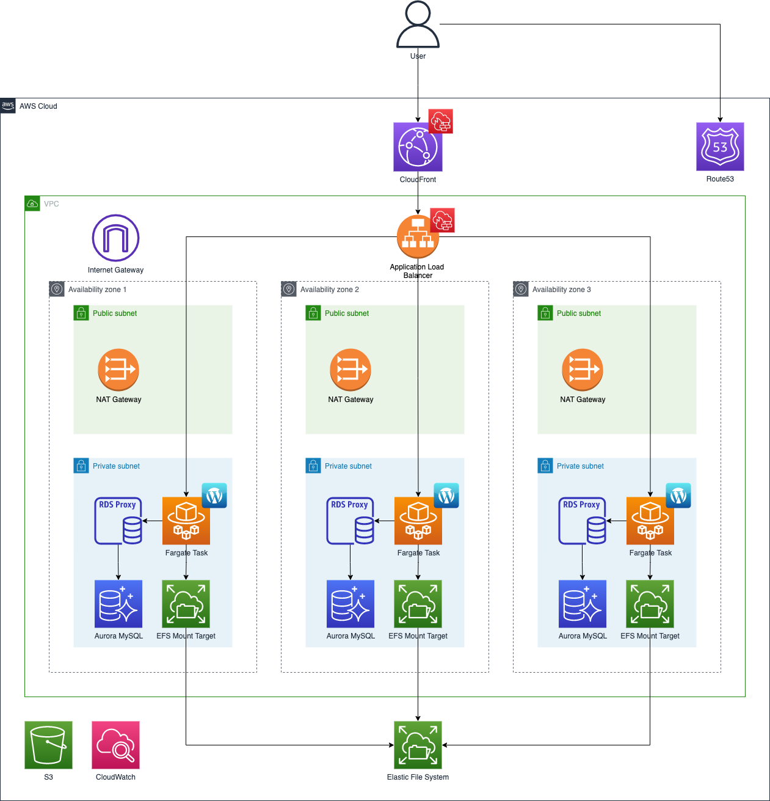

# IRCC WordPress Infrastructure

Host the IRCC WordPress site in an Amazon Elastic Container Service (ECS) Fargate cluster with the following architecture:

1. Virtual Private Cloud (VPC) with three public and three private subnets.
1. Internet Gateway (IGW) to allow inbound/outbound communication.
1. NAT Gateways (3) to allow private subnets to communicate with IGW.
1. CloudFront distribution, protected by Web Application Firewall (WAF), as main user request entry point.  CloudFront has an Application Load Balancer (ALB) as its origin.
1. ALB deployed in three public subnets and has an Elastic Container Service (ECS) Fargate cluster as its target.
1. ECS has a WordPress service with a task in each private subnet (3 total).
1. Relational Database Service (RDS) MySQL Cluster with instance in each private subnet serves as datbase for the WordPress ECS tasks.  
1. ECS WordPress tasks communicate with database through an RDS Proxy (performs connection pooling and management).
1. ECS WordPress tasks have an Elastic File System (EFS) mounted for shared file access (optional).

## Environment variables

The following Terraform variables are required:
* `cloudfront_custom_header_name`: Header name added by CloudFront. Prevents direct requests to ALB.
* `cloudfront_custom_header_value`: Header value added by CloudFront.  Prevents direct requests to ALB.
* `database_name`: Name of the database to create in the RDS cluster
* `database_username`: Root database user
* `database_password`: Root database user's password
* `encryption_key`: Base64-encoded Encryption Key [Generate one](https://github.com/cds-snc/gc-articles#config)
* `list_manager_endpoint`: Platform ListManager API endpoint
* `slack_webhook_url`: Slack incoming webhook to post SNS notifications to

WordPress [generated secret keys](https://api.wordpress.org/secret-key/1.1/salt/):
* `wordpress_auth_key`
* `wordpress_secure_auth_key`
* `wordpress_logged_in_key`
* `wordpress_nonce_key`
* `wordpress_auth_salt`
* `wordpress_secure_auth_salt`
* `wordpress_logged_in_salt`
* `wordpress_nonce_salt`

## Environment setup

A guide on how to setup a new AWS account's infrastructure.

### Domain
While in `infrastructure/terragrunt/env/${ENV_NAME}`:

1. terragrunt apply `hosted-zone`
2. In the `SRE Tools` AWS account, create a nameserver (NS) record to subdomain delegate to the new hosted zone.  

### Remaining infrastructure
While in `infrastructure/terragrunt/env/${ENV_NAME}`:

2. terragrunt apply `network`
3. terragrunt apply `load-balancer`
4. terragrunt apply `database`
4. terragrunt apply `ecr`
5. Push latest WordPress docker image to new ECR.
6. terragrunt apply `ecs`
7. Subscribe the account to [AWS Shield Advanced](https://docs.aws.amazon.com/waf/latest/developerguide/enable-ddos-prem.html) ($3,000 fee is paid once for all org accounts).
8. terragrunt apply `alarms`

### Populate database
:warning: This step is required because the [wp-config.php](../wordpress/wp-config.php#L132) file bundled in the Docker image expects a base WordPress site already installed.
1. [Setup a VPN connection](https://docs.google.com/document/d/1uFZ2josUt9-3fbohwauR8n2ACzel5wNqHtEgN8xepvE/edit).  As part of this, you will need to temporarily open the VPC Network ACLs to allow all inbound and outbound traffic.
2. Get a database dump with the new site's domain set and load it.
